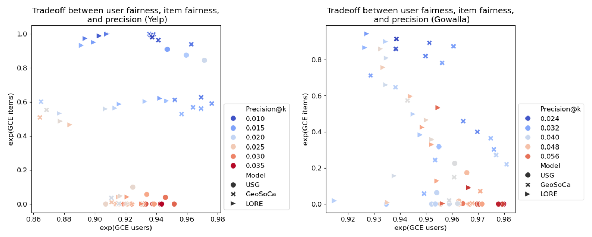
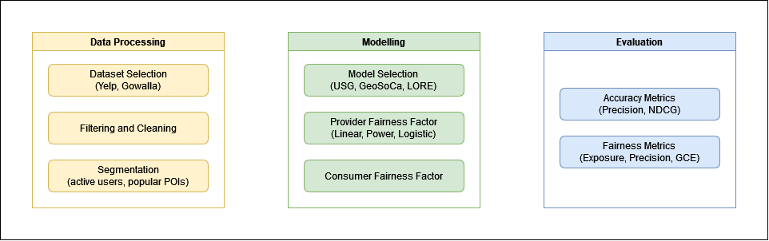

# CAPRI-FAIR: Context-Aware Interpretable Point-of-Interest Recommendation Framework with Fairness Considerations



**CAPRI-FAIR** is a fork of **CAPRI**, a specialized framework implemented in `Python` for evaluating and benchmarking several state-of-the-art POI recommendation models. The framework includes fairness considerations and is equipped with state-of-the-art models, algorithms, well-known datasets for POI recommendations, and multi-dimensional evaluation criteria (accuracy, beyond-accuracy and user-item fairness). It also supports reproducibility of results using various adjustable configurations for comparative experiments.

## Workflow of CAPRI-FAIR

The figure below shows the general framework for running this module.



## Installation

Just clone this repository and install the prerequisites below, or in the `requirements.txt`.

    - Python >= 3.4
    - NumPy >= 1.19
    - Pandas >= 0.25.2
    - SciPy >= 1.6
    - PyInquirer >= 1.0.3
    - Typing_extensions >= 3.7.4.3

### 🚀 Launch the Application

The app can be run in the CLI using the `main_cli.py` module.

```bash
$ python main_cli.py --help
usage: main_cli.py [-h] [--reranker [RERANKER]] [--fairness [FAIRNESS]] [--provider_alpha [PROVIDER_ALPHA]] [--exposure_model [EXPOSURE_MODEL]] [--consumer_beta [CONSUMER_BETA]] [--evaluation [EVALUATION ...]] [--k [K]] model dataset fusion

positional arguments:
  model                 Recommender model to use (GeoSoCa,LORE,USG)
  dataset               Dataset to test on (Gowalla,Yelp,Foursquare)
  fusion                Fusion method for the operands (Product,Sum,WeightedSum)

options:
  -h, --help            show this help message and exit
  --reranker [RERANKER]
                        Post-filter reranking method to use to use (TopK,Random,ItemExposure)
  --fairness [FAIRNESS]
                        Fairness context to consider (None,Provider,Consumer,Both)
  --provider_alpha [PROVIDER_ALPHA]
                        Coefficient of provider fairness factor
  --exposure_model [EXPOSURE_MODEL]
                        Coefficient of provider fairness factor
  --consumer_beta [CONSUMER_BETA]
                        Coefficient of consumer fairness factor
  --evaluation [EVALUATION ...]
                        Metrics to evaluate (Precision,Recall,mAP,NDCG)
  --k [K]               Number of recommended POIs to evaluate per user
```

Here is a sample command for running the GeoSoCa model on the Gowalla dataset, using a Linear provider fairness model and a provider fairness weight of 0.75. The Precision, Recall, mAP, and NDCG metrics are recorded, with the recommendation size `k = 10`.

```bash
$ python main_cli.py GeoSoCa Gowalla Sum --fairness Provider --provider_alpha 0.75 --exposure_model Linear --k 10 --evaluation Precision Recall mAP NDCG
```

This generates both evaluation files and the actual recommendation lists for each user.

```bash
# The evaluation file containing the selected evaluation metrics - It shows that the user selected GeoSoCa model on Gowalla dataset with Product fusion type, applied on 5628 users where the top-10 results are selected for evaluation and the length of the recommendation lists are 15
Eval_GeoSoCa_Gowalla_Product_5628user_top10_limit15.csv
# The txt file containing the evaluation lists with the configurations described above
Rec_GeoSoCa_Gowalla_Product_5628user_top10_limit15.txt
```